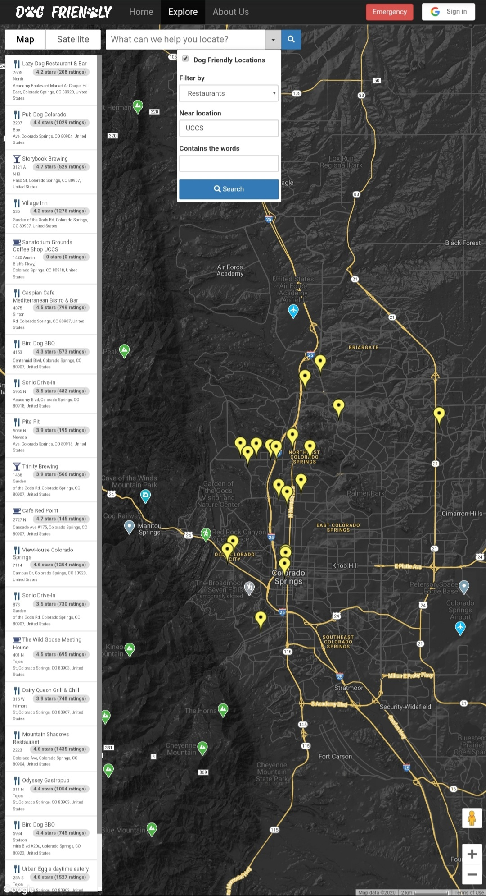
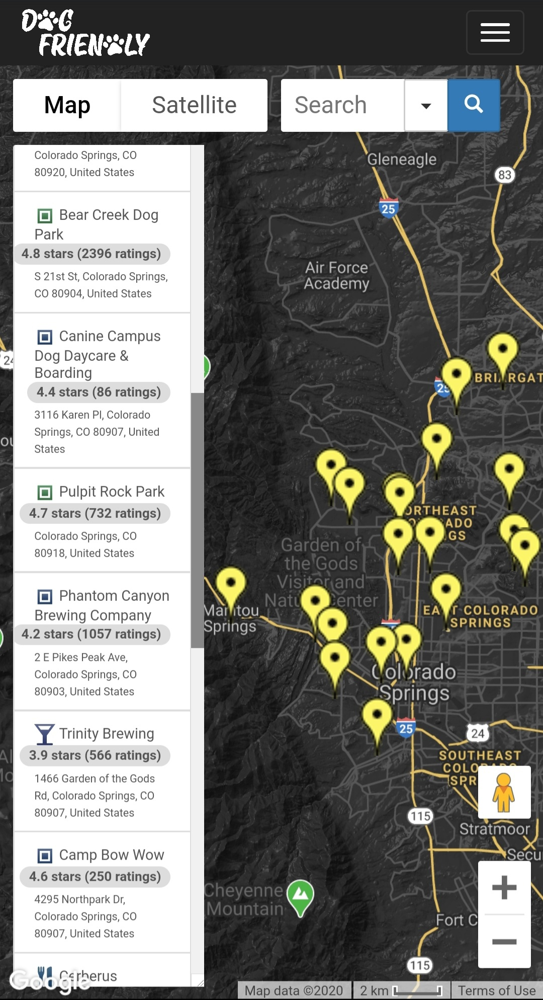
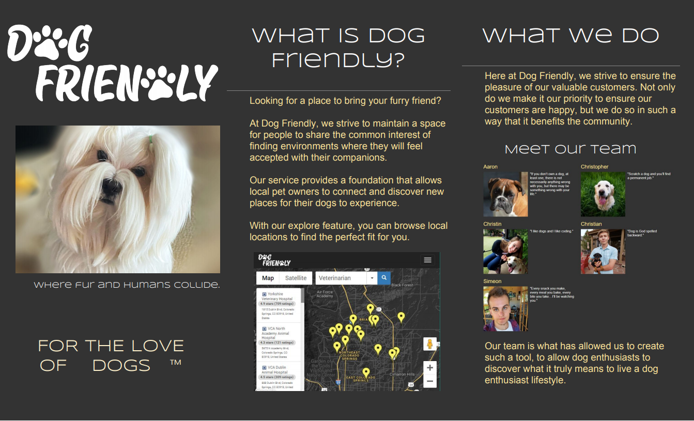
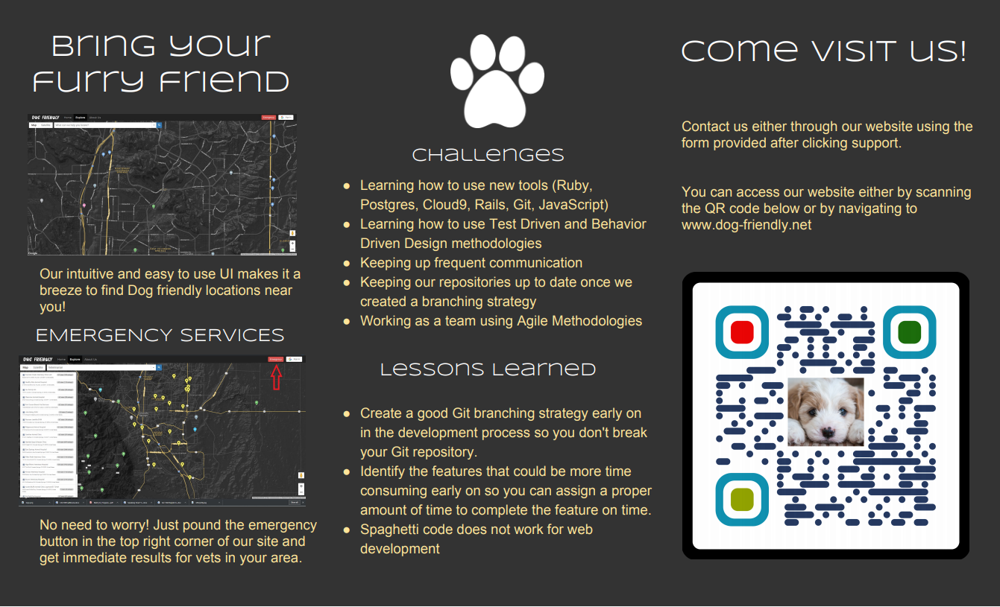

# 

This was my Software Engineering group project, built using Ruby on Rails. We were given the task to build a website where dog owners can gain information about locations where they can bring their dogs, as well as other tools for dog owners to use such as getting directions and information about locations, and finding restaurants, hotels, parks, etc... that meet a specific criteria.

## Demo
The site is hosted at two locations:
1.  http://dog-friendly.net/
2.  http://dog-friendly.herokuapp.com/

The first URL allows logging in with Google, while the other does not, and acts as a fallback server in case if there are any problems in the future.

Desktop view                    |  Mobile view
:------------------------------:|:--------------------------------------:
  |  


## Brochure



## Usage

The inititla project was build within the Cloud9 container. After cloning the repository, the following command will deploy the website unto the localhost web server on port 3000:
```console
rails server -b 0.0.0.0
```
<!--
And the following command will push the application to Heroku:
```
rake deploy:deployHeroku
```
-->
## Tests
* Use SimpleCov to check for the overall code coverage percentage, with Cucumber and Rspec. In order to generate the report, enter
  ```rake```
  And the report will be generated in coverage/.last_run.json.
* Use Jest to test the JavaScript code coverage. To view the code coverage using Jest, enter ```jest test --coverage``` and a table will be generated showing the coverage.
* To view the ratio of lines of test code compared with the lines of code using ```rake stats```.
* To test with reek, use the command ```reek [FILE NAME].rb```.
* To test with flog use the command ```flog [FILE NAME].rb```.

## Additional resources

The sprint progress updates can be found here:

1.	[Sprint 0-2](README/Sprints/Group%201%20Sprint%200-2%20Initial%20Stories%20and%20Diagrams.pdf)
2.	[Sprint 0-3](README/Sprints/Group%201%20Sprint%200-3.pdf)
3.	[Sprint 1-1](README/Sprints/Group%201%20Sprint%201-1.pdf)
4.	[Sprint 1-2](README/Sprints/Group%201%20Sprint%201-2.pdf)
5.	[Sprint 2-1](README/Sprints/Group%201%20Sprint%202-1.pdf)
6.	[Sprint 2-2](README/Sprints/Group%201%20Sprint%202-2.pdf)
7.	[Sprint 3-1](README/Sprints/Group%201%20Sprint%203-1.pdf)
8.	[Sprint 3-2](README/Sprints/Group%201%20Sprint%203-2.pdf)
9.	[Sprint 4-1 (Part 1)](README/Sprints/Group%201%20Sprint%204-1%20(Part%201).pdf)
10.	[Sprint 4-1 (Part 2)](README/Sprints/Group%201%20Sprint%204-1%20(Part%202).pdf)
11.	[Sprint 4-1 (Part 3)](README/Sprints/Group%201%20Sprint%204-1%20(Part%203).pdf)
12.	[Sprint 4-2](README/Sprints/Group%201%20Sprint%204-2.pdf)
---
The final presentation slides for the site can be found [here](README/Dog_Friendly_Presentation.pptx).

